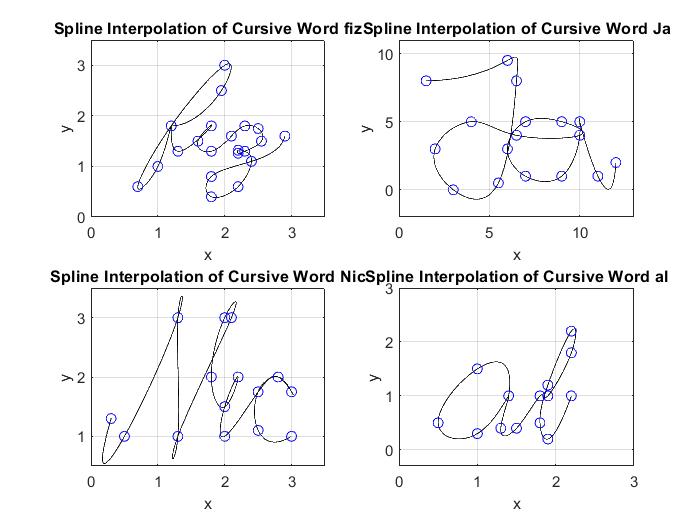

[](https://classroom.github.com/a/i8q0vJZ5)
# Group Assignment (MATLAB)

This repository contains instructions for SM-2302 MATLAB group assignment.

The assignment is due on **Tuesday, 7 November 2023 at 12:00 PM**.

Understand the sample code given in the [`Group2-2023.pdf`](Group2-2023.pdf) document, and read the instructions carefully.

Read [`notes.md`](notes.md) for some advice on good MATLAB programming style and marking scheme.

# Spline Your Name

Input:
```matlab
% data set for 'fiz'
x_1 = [1.2 1.95 2 1.2 0.7 1 1.2 1.3 1.8 1.6 1.8 2.1 ...
       2.3 2.5 2.55 2.3 2.2 2.2 2.3 2.4 2.2 1.8 1.8 2.4 2.9];
y_1 = [1.8 2.5 3 1.8 0.6 1 1.8 1.3 1.8 1.5 1.3 1.6 ...
       1.8 1.75 1.5 1.3 1.26 1.32 1.3 1.1 0.6 0.4 0.8 1.1 1.6];

% data set for 'Ja'
x_2 = [1.5 6 6.5 5.5 3 2 4 6.5 10 ...
    9 7 6 7 9 10 10 11 12];
y_2 = [8 9.5 8 0.5 0 3 5 4 4 ...
    5 5 3 1 1 4 5 1 2];

% data set for 'Nic'
x_3 = [0.3 0.5 1.3 1.3 1.3 1.3 2.1 2 1.8 2 ...
    2.2 2 2 2.5 2.8 3 3 2.8 2.5 2.5 3];
y_3 = [1.3 1 3 3 1 1 3 3 2 1.5 ...
    2 1.5 1 1.75 2 1.75 1.75 2 1.75 1.1 1];
    
% data set for 'al'
x_4 = [1.4 1 0.5 1 1.4 1.3 1.5 1.8 ...
    1.9 2.2 2.2 1.9 1.8 1.9 2.2];
y_4 = [1 1.5 0.5 0.3 1 0.4 0.4 1 ...
    1 1.8 2.2 1.2 0.5 0.2 1];
    
```

Output:

