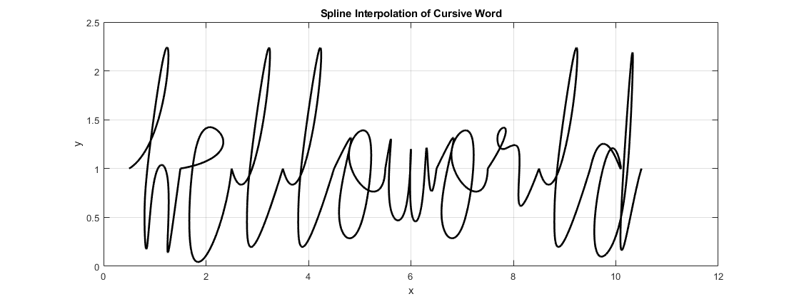

[](https://classroom.github.com/a/i8q0vJZ5)
# Spline Your Name

## Task 1 & 2: Cursive Names Coordinates and Plotting

In this task, we worked on visualizing the cursive coordinates for our names.

We recorded the x and y coordinates for the four cursive words:
- `fiz`
- `Ja`
- `Nic`
- `al`

### Script

```matlab
%  data points of x and y coordinates -------------------------------------
% data points 1 'fiz'
x_1 = [1.2 1.95 2 1.2 0.7 1 1.2 1.3 1.8 1.6 1.8 2.1 ...
       2.3 2.5 2.55 2.3 2.2 2.2 2.3 2.4 2.2 1.8 1.8 2.4 2.9];
y_1 = [1.8 2.5 3 1.8 0.6 1 1.8 1.3 1.8 1.5 1.3 1.6 ...
       1.8 1.75 1.5 1.3 1.26 1.32 1.3 1.1 0.6 0.4 0.8 1.1 1.6];

n_1 = length(x_1);
t_1 = 0:n_1-1;
tt_1 = 0:0.01:n_1-1;

xx_1 = spline(t_1, x_1, tt_1);
yy_1 = spline(t_1, y_1, tt_1);

% data points 2 'Ja'
x_2 = [1.5 6 6.5 5.5 3 2 4 6.5 10 ...
    9 7 6 7 9 10 10 11 12];
y_2 = [8 9.5 8 0.5 0 3 5 4 4 ...
    5 5 3 1 1 4 5 1 2];

n_2 = length(x_2);
t_2 = 0:n_2-1;
tt_2 = 0:0.01:n_2-1;

xx_2 = spline(t_2, x_2, tt_2);
yy_2 = spline(t_2, y_2, tt_2);

% data points 3 'Nic'
x_3 = [0.3 0.5 1.3 1.3 1.3 1.3 2.1 2 1.8 2 ...
    2.2 2 2 2.5 2.8 3 3 2.8 2.5 2.5 3];
y_3 = [1.3 1 3 3 1 1 3 3 2 1.5 ...
    2 1.5 1 1.75 2 1.75 1.75 2 1.75 1.1 1];

n_3 = length(x_3);
t_3 = 0:n_3-1;
tt_3 = 0:0.01:n_3-1;

xx_3 = spline(t_3, x_3, tt_3);
yy_3 = spline(t_3, y_3, tt_3);

% data points 4
x_4 = [1.4 1 0.5 1 1.4 1.3 1.5 1.8 ...
    1.9 2.2 2.2 1.9 1.8 1.9 2.2];
y_4 = [1 1.5 0.5 0.3 1 0.4 0.4 1 ...
    1 1.8 2.2 1.2 0.5 0.2 1];

n_4 = length(x_4);
t_4 = 0:n_4-1;
tt_4 = 0:0.01:n_4-1;

xx_4 = spline(t_4, x_4, tt_4);
yy_4 = spline(t_4, y_4, tt_4);
    

% plot settings -----------------------------------------------------------

% The code below creates four subplots, each displaying a cursive word's 
% spline interpolation and data points

figure(1)

% subplot 1
subplot(2,2,1), plot(xx_1, yy_1, 'k') % plot spline
hold on
plot(x_1, y_1, 'bo') % plot data points
axis([0 3.5 0 3.5])
title('Spline Interpolation of Cursive Word fiz')
xlabel('x')
ylabel('y')
grid on

% subplot 2
subplot(2,2,2), plot(xx_2, yy_2, 'k') % plot spline
hold on
plot(x_2, y_2, 'bo') % plot data points
axis([0 13 -2 11])
title('Spline Interpolation of Cursive Word Ja')
xlabel('x')
ylabel('y')
grid on

% subplot 3
subplot(2,2,3), plot(xx_3, yy_3, 'k') % plot spline
hold on
plot(x_3, y_3, 'bo') % plot data points
axis([0 3.5 0.5 3.5])
title('Spline Interpolation of Cursive Word Nic')
xlabel('x')
ylabel('y')
grid on

% subplot 4
subplot(2,2,4), plot(xx_4, yy_4, 'k') % plot spline
hold on
plot(x_4, y_4, 'bo') % plot data points
axis([0 3 -0.3 3])
title('Spline Interpolation of Cursive Word al')
xlabel('x')
ylabel('y')
grid on
```

### Output:


## Task 3: Word Combination & Function Scripting

In this task, we developed a method to combine individual letters into words. 

We created a function script, `plotWord.m`, that:
- takes a non-spaced string as input 
- converts the input to lowercase
- generates the corresponding cursive-written word(s).

To accomplish this, it was necessary to record the x and y coordinates for each individual letter as this data forms the basis for generating cursive words.


### Script:
```matlab
function plotWord(word)

% initializing final coords
x_word = [];
y_word = [];

% creating alphabet_coordinates
x_a = [0.5 0.75 1 1.3 1 0.5 1 1.3 1.3 1.5];
y_a = [1 1.5 1.5 1 1.5 0.5 0.3 1 0.4 1];

x_b = [0.5 1.2 1.2 0.9 0.8 0.85 1.1 1.3 1.2 1.15 1.35 1.5];
y_b = [1 1.8 2.2 1.2 0.5 0.2 0.2 0.8 1.2 0.9 0.6 1];

x_c = [0.5 1 1.3 1.4 1.3 1 0.9 1.25 1.5];
y_c = [1 1.3 1.3 1 1.3 1 0.3 0.2 1];

x_d = [0.5 0.9 1.1 0.9 0.6 0.7 1.1 1.3 1.3 1.1 1.2 1.5];
y_d = [1 1.2 1 1.2 0.55 0.1 0.5 1.6 2.1 0.5 0.3 1];

x_e = [0.5 1.3 1.2 0.8 0.7 1.1 1.5];
y_e = [1 1.2 1.4 1.2 0.2 0.2 1];

x_f = [0.5 1 1.25 1.2 0.9 0.9 1.05 1 1.2 1.5];
y_f = [1 1 1.8 2.2 0.6 -0.1 0.1 1 0.5 1];

x_g = [0.5 1 1.3 1 0.8 0.95 1.2 1.3 1.2 1 0.8 1.1 1.5];
y_g = [1 1.5 1.4 1.5 1.1 0.9 1.1 1.4 0.3 -0.5 0 0.6 1];

x_h = [0.5 1.2 1.2 0.9 0.8 0.85 1 1.25 1.25 1.3 1.5];
y_h = [1 1.8 2.2 1.2 0.5 0.2 0.9 0.9 0.25 0.25 1];

x_i = [0.5 1 1 1 1.2 1.5];
y_i = [1 1.2 1.5 0.5 0.2 1];

x_j = [0.5 1 1.15 1 0.8 0.8 1.1 1.5];
y_j = [1 1 1.2 -0.5 -0.8 -0.5 0 1];

x_k = [0.5 1.2 1.2 0.9 0.8 0.85 1 1.25 1.15 1 1.25 1.5];
y_k = [1 1.8 2.2 1.2 0.5 0.2 0.9 0.9 0.7 0.6 0.2 1];

x_l = [0.5 0.9 1.2 1.2 0.9 0.8 0.9 1.5];
y_l = [1 1 1.8 2.2 1.2 0.5 0.2 1];

x_m = [0.5 0.7 0.5 0.8 1 0.9 1.1 1.3 1.2 1.5];
y_m = [1 1.2 0.6 1.2 1.2 0.6 1.2 1.2 0.6 1];

x_n = [0.5 0.7 0.5 0.8 1.3 1.2 1.3 1.5];
y_n = [1 1.2 0.6 1.2 1.2 0.6 0.6 1];

x_o = [0.5 0.8 0.6 1 1.2 0.8 1.1 1.5];
y_o = [1 1.2 0.5 0.4 1.3 1.2 0.8 1];

x_p = [0.5 0.8 0.6 0.8 1.2 1.1 0.8 1.1 1.5];
y_p = [1 1 -0.5 1.1 1.4 0.8 1 0.8 1];

x_q = [0.5 1.2 0.8 0.8 1.05 1.2 1 1.2 1.1 1.5];
y_q = [1 1.3 1.3 0.8 0.8 1.2 -0.5 0.2 0.6 1];

x_r = [0.5 0.85 0.7 0.8 1.1 1.1 1.5];
y_r = [1 1.4 1.35 1.2 1.2 0.7 1];

x_s = [0.5 1 0.9 1.2 0.8 0.6 0.8 1.5];
y_s = [1 1.3 1.3 0.7 0.5 0.8 0.6 1];

x_t = [0.5 1.2 1.2 0.9 0.8 0.85 1.1 1.2 0.8 0.7 1.5];
y_t = [1 1.8 2.2 1.2 0.5 0.2 0.2 0.8 1.2 1 1];

x_u = [0.5 0.7 0.75 1.1 1.2 1.2 1.5];
y_u = [1 1.2 0.6 0.6 1.2 0.6 1];

x_v = [0.5 0.7 0.8 1 1.2 1.1 1.5];
y_v = [1 1.2 0.6 0.5 1.2 1 1];

x_w = [0.5 0.6 0.6 0.9 1 1 1.2 1.3 1.35 1.5];
y_w = [1 1.2 0.6 0.6 1.2 0.6 0.6 1.2 0.9 1];

x_x = [0.5 0.9 0.85 0.6 0.95 1.2 0.9 1.2 1.5];
y_x = [1 1.2 0.8 0.6 0.9 1.2 0.8 0.6 1];

x_y = [0.5 0.7 0.7 1 1.1 1 0.8 0.7 1 1.5];
y_y = [1 1.1 0.6 0.7 1.2 -0.2 -0.4 0.1 0.4 1];

x_z = [0.5 1.05 0.9 0.9 1.1 0.7 0.7 1 1.5];
y_z = [1 1.1 0.6 0.7 0 -0.5 0.1 0.4 1];

% initialise a cell array for alphabet_coordinates
alphabet_coordinates = cell(1, 26);

x = {x_a, x_b, x_c, x_d, x_e, x_f, x_g, x_h, x_i, x_j, x_k, x_l, x_m, ...
    x_n, x_o, x_p, x_q, x_r, x_s, x_t, x_u, x_v, x_w, x_x, x_y, x_z};
y = {y_a, y_b, y_c, y_d, y_e, y_f, y_g, y_h, y_i, y_j, y_k, y_l, y_m, ...
    y_n, y_o, y_p, y_q, y_r, y_s, y_t, y_u, y_v, y_w, y_x, y_y, y_z};

for letter = 1:26
    alphabet_coordinates{letter} = {x{letter}, y{letter}};
end

% convert word to lower case
word = lower(word);

% define letter spacing
spacing = 1;

    % iterating through each letter
    for i = 1:length(word)
        letter = word(i);

        % check if all characters in the word are letters
        if (~isletter(letter) || ~ischar(letter))
            error('The word contains characters that are not letters.')
        end

        % double(letter) converts the letter to ASCII
        % lowercase a-z have decimal values from 97-122
        % subtracting 96 so a corresponds to 1 and so on
        index = double(letter) - 96;

        % extract letter coordinates
        letter_coords = alphabet_coordinates{index};
        x = letter_coords{1};
        y = letter_coords{2};

        % adjust x coords to account for letter spacing
        x = x + (i-1)*spacing;

        % interpolation
        n = length(x);
        t = 0:n-1;
        tt = 0:0.01:n-1;
        xx = spline(t, x, tt);
        yy = spline(t, y, tt);

        % add coords to the final word
        x_word = [x_word, xx];
        y_word = [y_word, yy];
    end

    % plot
    figure(2)
    plot(x_word, y_word, 'k', 'LineWidth', 2) % plot spline
    grid on
    title('Spline Interpolation of Cursive Word')
    xlabel('x')
    ylabel('y')
end
```

### Input:
```matlab
plotWord('HelloWorld')
```

### Output:
